# whitebox-aes-rs

Rust workspace implementing Baek–Cheon–Hong’s “White-Box AES Implementation Revisited” scheme (two AES-128 blocks with sparse unsplit 256-bit encodings). Built for study and experimentation—not for production key protection.

## Highlights
- **Clean AES-128 core (`aes-core`)**: key expansion, encrypt/decrypt, NIST vectors.
- **White-box generator (`wbaes-gen`)**: sparse unsplit affine encodings, per-round 32×16→256-bit tables, mask gadgets, external encodings (optional).
- **Runtime evaluator (`wbaes-runtime`)**: table execution for 32-byte blocks with external encodings.
- **CLI (`wbaes-cli`)**: generate instances, encrypt/decrypt, correctness check, and a self-contained demo.
- **Docs & tooling**: design/background docs, example, Criterion benches, CI (fmt/clippy/test).

## Repository layout
- `crates/` — `aes-core`, `wbaes-gen`, `wbaes-runtime`, `wbaes-cli`.
- `docs/` — `design.md` (mapping scheme→code), `whitebox_background.md` (threat model/context).
- `examples/basic.rs` — minimal generation/encryption roundtrip.
- `benches/wbaes_bench.rs` — generation/runtime benchmarks.
- `.github/workflows/ci.yml` — fmt/clippy/test on stable.

## Quick start (CLI)
```bash
# Generate an instance (no external output encoding by default)
cargo run -p wbaes-cli -- gen \
  --key-hex 000102030405060708090a0b0c0d0e0f \
  --out wb.bin

# Encrypt a multiple of 32 bytes
cargo run -p wbaes-cli -- enc --instance wb.bin --input plain.bin --output ct.bin

# Decrypt (only when external output encoding is disabled)
cargo run -p wbaes-cli -- dec \
  --instance wb.bin \
  --key-hex 000102030405060708090a0b0c0d0e0f \
  --in ct.bin --out pt.bin

# Compare white-box vs AES for random samples
cargo run -p wbaes-cli -- check \
  --instance wb.bin \
  --key-hex 000102030405060708090a0b0c0d0e0f

# Quick demo: generate key/instance, encrypt random 32B, decrypt back
cargo run -p wbaes-cli -- demo
```

## Library sketch
```rust
use aes_core::{Aes128Key, expand_key, encrypt_block};
use rand_chacha::ChaCha20Rng;
use rand::SeedableRng;
use wbaes_gen::{Generator, GeneratorConfig};
use wbaes_runtime::WbCipher256;

let key = Aes128Key::from([0u8; 16]);
let mut gen = Generator::with_config(
    ChaCha20Rng::from_seed([1u8; 32]),
    GeneratorConfig { external_encodings: false },
);
let instance = gen.generate_instance(&key);
let cipher = WbCipher256::new(instance);

let mut block = [0u8; 32];
cipher.encrypt_block(&mut block);
```

See `examples/basic.rs` for a full AES-consistency check.

## Design & background
- Implementation mapping and data flow: `docs/design.md`
- Threat model and CEJO/Chow context: `docs/whitebox_background.md`

<details>
<summary><strong>What is white-box cryptography? (primer)</strong></summary>

White-box cryptography studies how to implement a cipher when the attacker controls the execution environment (can read/modify code, tables, and intermediate values). Key ideas:

- **CEJO/Chow framework (2002):** rewrite AES as key-dependent lookup tables (T-boxes, Ty tables), wrap each with random input/output encodings, add mixing bijections for diffusion, and optionally external encodings to hide plaintext/ciphertext domains.
- **Threat model:** the adversary sees the implementation internals (white-box) rather than treating the cipher as a black box; the goal is to raise the effort to extract the key.
- **Known attacks:** algebraic removal of encodings (BGE), CEJO affine-equivalence attacks, and practical side-channel/DCA attacks on software traces. Classic designs are breakable at modest cost.
- **Revisited scheme (Baek–Cheon–Hong 2016):** increases state size to 256 bits (two AES blocks) and uses unsplit 256-bit affine encodings with a sparse banded structure; each round is the XOR of 32 per-byte tables with random masks. This raises generic attack cost but remains research/educational.
- **Limitations:** not side-channel hardened; external encodings help modestly; all tables and keys should be treated as sensitive; use cases are primarily academic (evaluation, experimentation, benchmarking).

</details>

### White-box AES flow (mermaid)

```mermaid
flowchart LR
    P["Plaintext (32B)"]
    F0["External input encoding F(0)"]
    R1["Round 1: 32 tables"]
    R2["Round 2"]
    R3["Round 3"]
    R4["Round 4"]
    R5["Round 5"]
    R6["Round 6"]
    R7["Round 7"]
    R8["Round 8"]
    R9["Round 9"]
    R10["Round 10 (SR only, Mout folded)"]
    OUT["Ciphertext (32B)"]

    P --> F0 --> R1 --> R2 --> R3 --> R4 --> R5 --> R6 --> R7 --> R8 --> R9 --> R10 --> OUT

    classDef tbl fill:#dfe7fd,stroke:#5c6bc0,stroke-width:1px,color:#1b1b1b;
    class R1,R2,R3,R4,R5,R6,R7,R8,R9,R10 tbl;
```


Key references:
- S. Chow et al., “White-Box Cryptography and an AES Implementation,” SAC 2002.
- J. A. Muir, “A Tutorial on White-box AES,” 2013.
- C. H. Baek, J. H. Cheon, H. Hong, “White-Box AES Implementation Revisited,” JCN 2016 (ePrint 2014/688).

## Security model (please read)
- **Research/educational only.** Not a secure key-protection mechanism.
- Vulnerable to known analytic/DCA-style attacks (BGE, Baek–Cheon–Hong toolbox, etc.).
- No side-channel hardening. External encodings are optional and default off for testability.
- Treat all keys and tables as sensitive; avoid logging or exposing them.

## Build, test, bench
- MSRV: stable Rust 1.75+ (edition 2021).
- CI: fmt, clippy (`-D warnings`), test on stable.
- Local:
  - `cargo fmt --all`
  - `cargo clippy --all-targets --all-features --workspace -- -D warnings`
  - `cargo test --workspace`
  - `cargo bench` (Criterion; generation is heavyweight)
